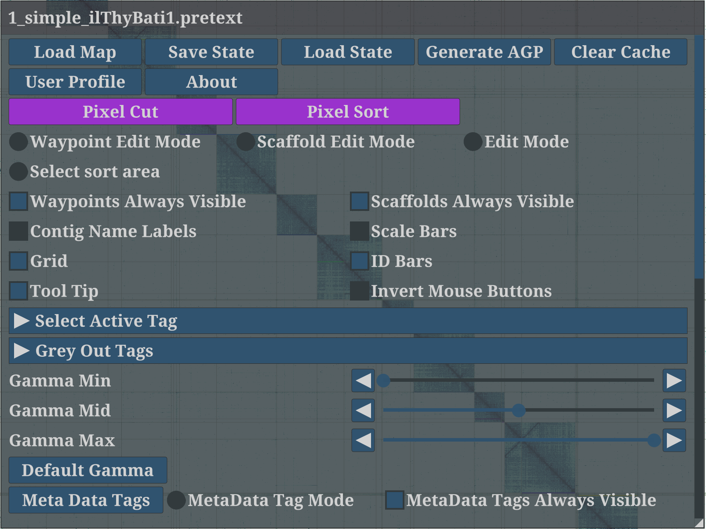

# PretextView
Paired REad TEXTure Viewer. OpenGL Powered Pretext Contact Map Viewer.<br/>

PretextView is a desktop application for viewing pretext contact maps.<br/>

# Usage

## Home screen

- `U` or `middle mouse button`: enter main GUI.
- `right mouse button`: holding down and move to drag the Hi-C figure move within the window. 
- `Mouse scroll` to zoom. A three button mouse is recomended.
- `E`: enter the Edit mode.
- `K`: enter the Select sort area mode.
- `M`: enter the Meta Tag edit mode.
- `S`: enter the Scaffold painting mode.
- `X`: enter the extension edit mode.
- `W`: endter the Waypoint edit mode.
- `J`: window jump to the diagnol line without changing the zoom-level, which is usefull for selecting the correct place for a small fragment.
- `L`: open / close the Grid.
- `T`: open / close the Tooltip.
- `I`: open / close the ID bar.
- `Up` / `Down`: change the color map.
- `Left` / `Right`: decrease / increase the Gamma mid (default: 0.5).

## Main GUI (`U`)


- `Load Map`: select `.pretext` file to load the HiC figure.
- `Save State`: Save a specific to contain edits, painted scaffolds information, meta tags, waypoints, camera position, zoom level, window settings. Actually, the history is automatically saved into a file with hashed name in the cache file directory (for example, `/Users/[yourUserName]/.config/PretextView/` on mac).
- `Load State`: select a file to load the state.
- `Generate AGP`: save the curated genome into the `.agp` format.
- `Clear Cache`: Clear all edits and revert to the pre-curation state. **Please note this action is irreversible.**

## Edit mode (`E`)
- `left mouse button`: Click and drag with the left mouse button to select an are to zoom to. 
- Pickup a region of a contig with the left mouse button, pickup a whole contig with the middle mouse button or spacebar. Place a region with the left mouse button. Invert a selected region with the middle mouse button or spacebar. Undo the last edit with the 'q' key. Exit edit mode with the 'e' key. Use the GUI to see a list of completed edits.

## Waypoint mode (`W`)
- `left mouse button`: place a waypoint.
- `middle mouse button` or `spacebar`: delete a waypoint. 
- `W`: Exit waypoint mode. 
- `L`: change the way point lines to **vertical**, **horizontal** or **cross**.
- Use the GUI to see a list of waypoints, click on a waypoint in the list to vist it.

## Scaffold edit mode (`S`)
Enter scaffolding mode with the 's' key.
- Use the GUI to see a list of scaffolds.

## Select sort area model (`K`)

After click `YaHS sort` button in the main UI, it will defaultly run sort globally. If enter the the `select sort area mode`(by pressing `K`), it can sort only the selected area with pressing `Space` after selecting at least 3 contigs. 

Enter the select sort area mode by pressing `K`.
- `Left mouse click`: select / un-select area for sorting.
- `S`: clear all the select area.
- `Space`: call `YaHS sort` to sort the select area **(NOTE: only work if select at least 3 fragments)**.
- `Q/W`: quit/redo edit (currently will change the edit made globally not only the edit made within the selected area, so use this with caution as it can change also other parts)

## Sort fragments according to link score

Usage, first endter the main GUI: 
- **Right click** the `YaHS Sort` button to open sort settings, 
  - `Smallest Frag Size (pixels)` (defaul: 2) which represents the smallest fragment size in unit of pixels to consider during the sorting
  -  `Link Score Threshold`: $S_{thresh}$ (defaul: 0.4).
  -  Select the sort mode: 
     -  `UnionFind`: sort all links higher than $S_{thresh}$ and then traverse all the links by from high to low. 
     -  `Fuse`: traverse all links and fuse two chains.
- **Left click** the `YaHS Sort` button: run.
- **Redo all edits**
- **Erase all edits**

## User Profile

Click the `User Profile` button in main GUI.


Set the `Meta tags`, `Background Color`, `Color Map`(HiC figure), `Extension settings`.


# Saving
Map state is automatically saved (`$XDG_CONFIG_DIR` or `~/.config` on Unix, and the `%APPDATA%` folder on Windows) while the app runs, and is loaded on map load.<br/>
You can also manually save/load state via the UI.

# AGP Output
Map state can be output in [AGP](https://www.ncbi.nlm.nih.gov/assembly/agp/AGP_Specification/) format via the UI. Objects are first created according to the scaffolds defined in scaffolding mode, with remaining sequences output as singletons.<br/>
## AGP Correction
Note that object/part sizes will only be accurate up to the size of an individual map texel, and that any input sequences smaller than an individual texel will not be output.<br/>
AGP files can be corrected by the included python script [AGPCorrect](https://github.com/wtsi-hpag/PretextView/blob/master/AGPCorrect), which requires access to the input sequences in (gzipped) FASTA format.
```bash
AGPCorrect /path/to/ref.fa(.gz) /path/to/current/map.agp >/path/to/corrected_scaffs.agp
```
The script requires
* Python >= 3.8
* [Biopython](https://biopython.org/)


# Requirments, running
OpenGL 3.3<br/>
2G of RAM<br/>

# Windows, Mac and Linux Builds
The prebuilt apps for Windows, Mac and Linux are available [here](https://github.com/wtsi-hpag/PretextView/releases).<br/>
The Mac app was built on MacOS 10.13.6<br/>
The Linux app was built on kernel 3.13<br/>
The Windows app was build on Windows 10, and is known to work on at least Windows 7.

# Third-Party acknowledgements
PretextView uses the following third-party libraries:
* [glfw](https://github.com/glfw/glfw)
* [libdeflate](https://github.com/ebiggers/libdeflate)
* [FontStash](https://github.com/memononen/fontstash)
* [Nuklear](https://github.com/vurtun/nuklear)
* [glad](https://github.com/Dav1dde/glad)
* [stb_image](https://github.com/nothings/stb/blob/master/stb_image.h)
* [stb_image_write](https://github.com/nothings/stb/blob/master/stb_image_write.h)
* [stb_truetype](https://github.com/nothings/stb/blob/master/stb_truetype.h)
* [stb_sprintf](https://github.com/nothings/stb/blob/master/stb_sprintf.h)
* Fonts from the 'Droid Serif' font set
* [Icons from open-iconic](https://github.com/iconic/open-iconic)

# Installation 

Requires:
* clang >= 11.0.0 [Unix]
* clang-cl >= 11.0.0 [Windows]
* cmake >= 3.1.7

```bash
# git submodule update --init --recursive  # Adding dependencies from third-party libraries which is contained in the install script
./install.cmake.sh  # [Unix]
install.cmake.bat # [Windows]
```
Application will be installed to the 'app' folder in the source directory.


**NOTE for Mac users who downloads this from Releases page**. If the user is told that the software is damaged, please unzip the file and run 
```bash
xattr -d com.apple.quarantine PretextViewAI-1.0.0-Darwin.dmg
```
to remove the **quarantine** and then unmount and re-mount the dmg file. And then try to open the `PretextViewAI.app`.


# Details of sorting algorithm

## Link score calculation 


The score between two fragments represents the level of continuity. The higher score the better continuity.

The link score calculation method refers to [YaHS](https://github.com/c-zhou/yahs). Thus, we call this function as **YaHS Sort**.

Reference: Chenxi Zhou, Shane A McCarthy, Richard Durbin, YaHS: yet another Hi-C scaffolding tool,
Bioinformatics, Volume 39, Issue 1, January 2023, btac808, https://doi.org/10.1093/bioinformatics/btac808

---

## Union Find Mode

- Select and sort all links with a score higher than the threshold (default: 0.4).
- Traverse all the links from highest to lowest score, consider the the two ends.
  
Suppose we have two chains:
$$A: [a_1, a_2, a_3, \ldots, a_i, \ldots, a_n]$$
$$B: [b_1, b_2, b_3, \ldots, b_j, \ldots, b_m]$$
They can only be linked if there is a strong (larger than threshold) link between one of the following pairs:$[a_1, b_1], [a_1, b_m], [a_n, b_1], [a_n, b_m]$


---

## Fuse Mode & Deep Fuse

For two chains: $A: [a_1, a_2, a_3, \ldots, a_i, \ldots, a_n]$ and $B: [b_1, b_2, b_3, \ldots, b_j, \ldots, b_m]$

The Union Find approach considers only the two ends. Now we consider fusing these two chains into one if $[a_i, b_j]$ is a link with a score higher than the threshold.

**In fuse mode**, the tail of $A$, denoted $A_t$:
$[a_i, a_{i+1}, \ldots, a_n]$
and the head of $B$, denoted $B_h$:
$[b_1, b_2, \ldots, b_j]$
are fused. Let $a_{i-1}$ be the source, and $b_{j+1}$ be the sink. We insert $A_t$ and $B_h$ in the optimal way to achieve the highest total score, preserving their internal order.

If the link score of the fused chain $S_F$ is larger than the original scores plus threshold:
$$S_F = \sum_{i=0}^{N-1} s(f_i, f_{i+1}) \ge \Bigl(S_{A_t} + S_{B_h} + S_{\text{thresh}}\Bigr)$$
where $f \in F$, and $F$ is the chain fused from $A_t$ and $B_h$. The score of $A_t$ is $S_{A_t} = \sum_{i=0}^{N_{A_t}-1} s(a_i, a_{i+1})$ with $a \in A_t$.

---

**Fuse mode:**  
Runs the fuse process after Union Find. Suitable for samples with **fewer than 800 fragments**.

**Deep fuse:**  
Runs the fuse process without using Union Find, suitable for samples with **fewer than 100 fragments**.
